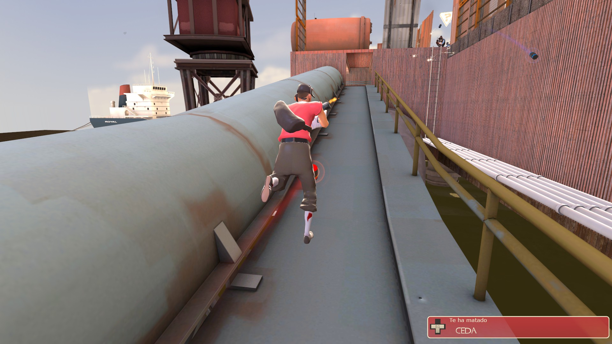
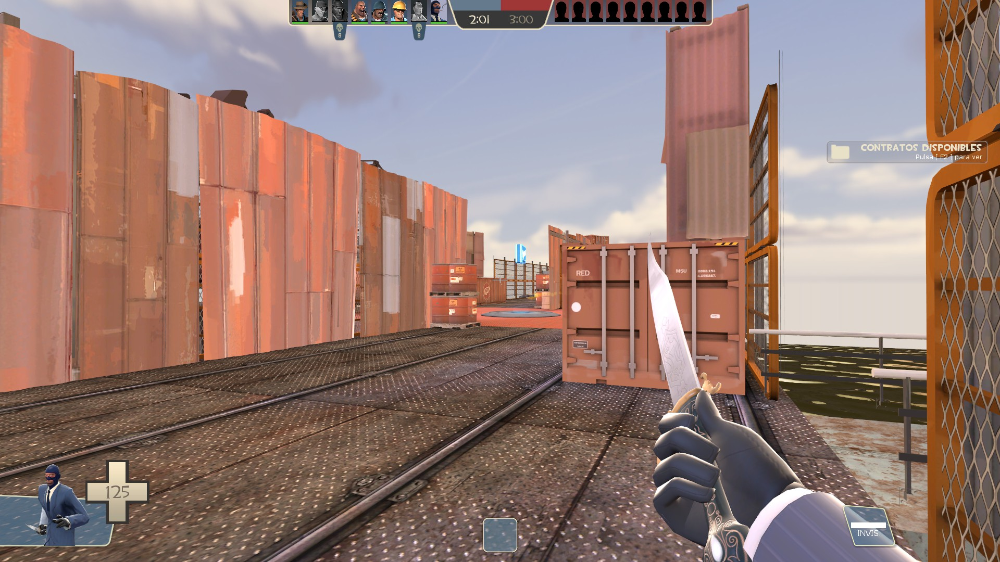
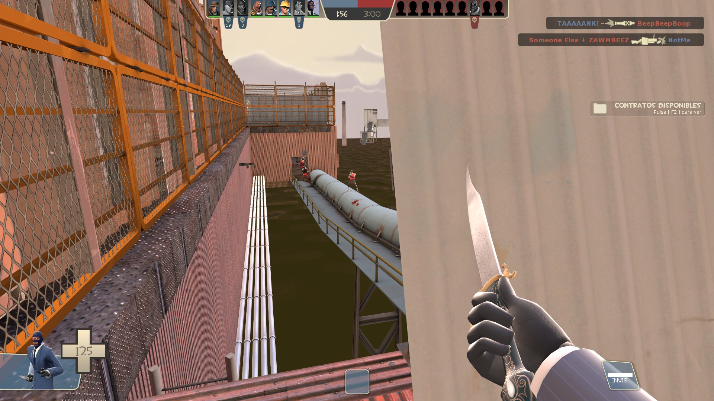
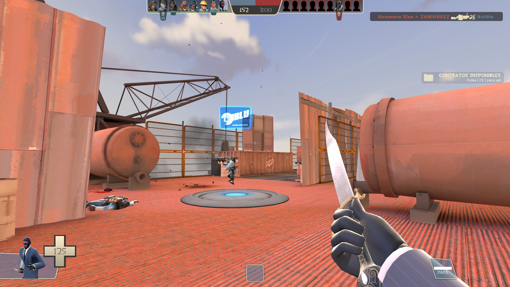
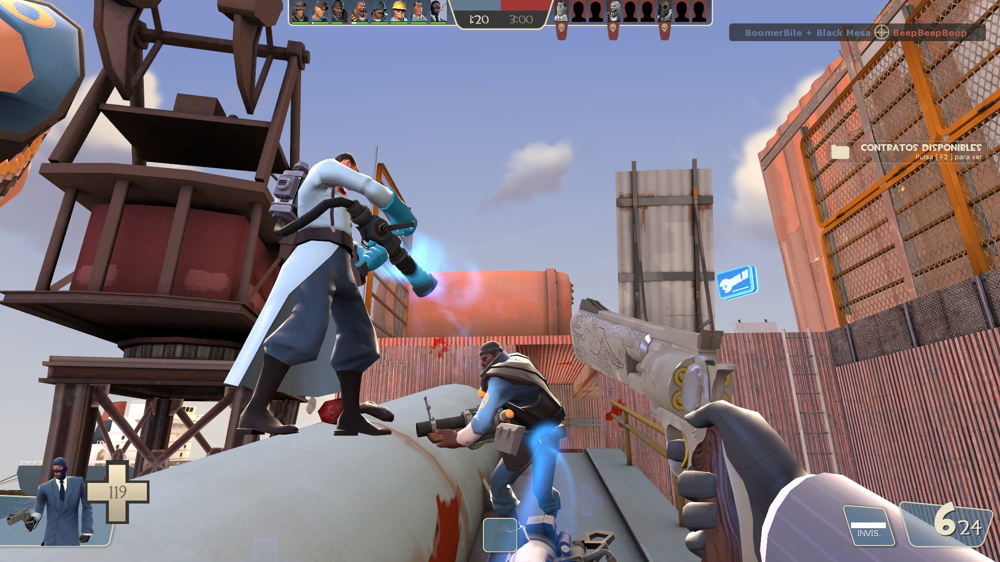
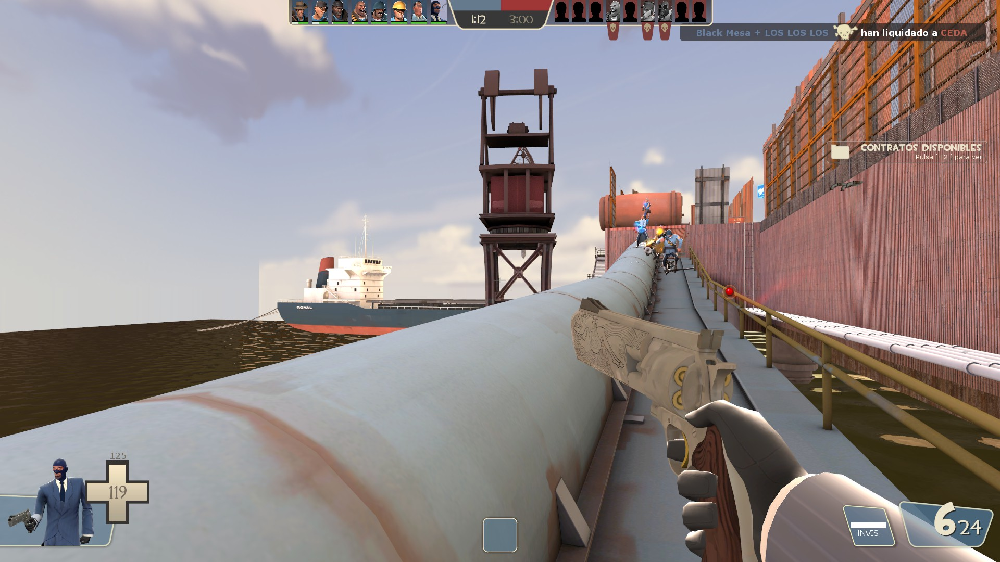

# FortressFramework — `oil_rig`

> Carte multijoueur personnalisée pour Team Fortress 2, conçue avec Valve Hammer Editor.

---

## Français

### Description

**FortressFramework** est un projet de level design réalisé pour **Team Fortress 2**, un jeu de tir en équipe développé par Valve sur le moteur **Source Engine**. La carte créée, nommée `oil_rig`, prend place dans un complexe industriel pétrolier avec des plateformes multi-niveaux, des tuyaux imposants, des réservoirs et des conteneurs maritimes.

Le projet a été conçu entièrement dans **Valve Hammer Editor**, l'outil officiel de création de niveaux pour les jeux Source. Il comprend la modélisation des volumes de jeu, le placement des textures et lumières, la configuration des entités de gameplay, ainsi que les tests en conditions réelles dans TF2.

### Fonctionnalités

- Thème industriel pétrolier immersif (oil rig / plateforme offshore)
- Design multi-niveaux favorisant la verticalité et les lignes de tir variées
- Skybox `sky_hydro_01` pour une atmosphère maritime cohérente
- Éclairage et post-processing configurés pour une lisibilité optimale en jeu
- Testé en conditions de jeu multijoueur Team Fortress 2

### Outils & Technologies

| Outil | Usage |
|-------|-------|
| Valve Hammer Editor | Création et édition de la carte (`.vmf`) |
| Source Engine (TF2) | Moteur de jeu cible |
| Team Fortress 2 | Plateforme de test en conditions réelles |

---

## English

### Description

**FortressFramework** is a level design project built for **Team Fortress 2**, a team-based shooter developed by Valve on the **Source Engine**. The map, named `oil_rig`, takes place in an industrial oil complex featuring multi-level platforms, massive pipes, storage tanks, and shipping containers.

The project was built entirely in **Valve Hammer Editor**, the official level creation tool for Source engine games. It covers gameplay volume modelling, texture and lighting placement, gameplay entity configuration, and real-world testing inside TF2.

### Features

- Immersive industrial oil rig theme (offshore platform setting)
- Multi-level design encouraging verticality and diverse sightlines
- `sky_hydro_01` skybox for a coherent maritime atmosphere
- Lighting and post-processing tuned for optimal in-game readability
- Playtested in live Team Fortress 2 multiplayer conditions

### Tools & Technologies

| Tool | Usage |
|------|-------|
| Valve Hammer Editor | Map creation and editing (`.vmf`) |
| Source Engine (TF2) | Target game engine |
| Team Fortress 2 | Live playtesting platform |

---

## Screenshots

### Hammer Editor — Map Layout

| | | |
|---|---|---|
|  |  |  |

### In-Game — Team Fortress 2

| | | |
|---|---|---|
|  |  |  |
|  |  |  |

---

*Oussema Fatnassi & Oroitz Lago Ramos — 2026*
